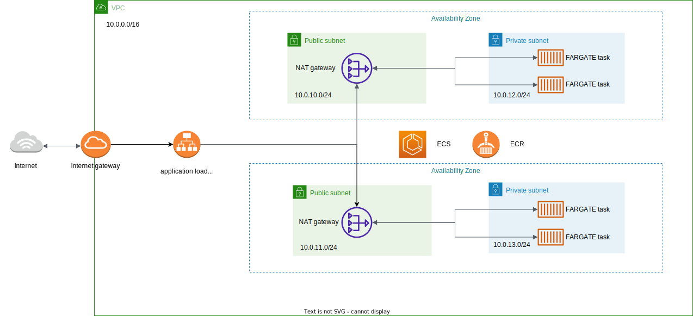

## Terraform Pipeline

This is a terraform project in charge of creating the IaC for an ECS cluster in aws the application hosted
in the cluster can be found in the following repository:

https://github.com/SalvadorM271/mern-app/tree/main

## AWS services and resources use:

- VPC
- Subnets
- Security groups
- Internet Gateway
- NAT gateway
- ECS cluster
- Application Load Balancer
- Autoscaling
- Cloudwatch logs

## How it works 

First we set up our VPC once the is ready, is time to create the subnets i have created two in two different availability zones in the us-east-2 region, one private and one public, after that I created an internet gateway to gran internet access to the public subnet with the help of a routing table, there is also a need for the private subnet to connect to the outside but not directly, for that i use a NAT gateway on each AZ because if one the AZ fails and only one NAT is taking all the traffic the whole infrastructure falls so i decided to use two even if it might me a bit more expensive, than using just one since it gives the infrastructure more resiliency which is worth the price.

Once that is done is time to create an ECS cluster but before that an ECR repository with the application image is needed, i decided to create the ECR manually because it might cause problems at the moment of erasing the infrastructure since the images within will have to be erase first, but beyond that the fact that the infrastructure is destroy does not necessarily means that we want to get rid of the images too, so it might become an inconvenience to create it with terraform, I also decided to have one repository for each environment image since is best to have each environment as separated as possible from each other, to the point that in some cases they are created in different regions.

Once we have the ECR is time to focus on the ECS cluster in order to host the application a task definition and a service were created but there is also a need for a database for that I use a MongoDB Atlas cluster, im creating one cluster for each environment with terraform since is best to have our environments as separated as possible.

Once that is done there is a need to route the traffic that is coming from the outside to the application and since Im using two AZ is best to use an application load balancer to distribute the load between the replicas of the application.

As for my personal domain Im using cloudflare to connect it to my load balancer since is free it would save the cost of using route 53.

And finally i configure the autoscaling to increase or lower the number of replicas base on the CPU and memory usage of the FARGATE container which are the serverless alternative to using EC2 instances on our ECS cluster.

Autoscaling is very important to save cost since it will not only create more instances when there is more demand but also decrease the number when there is a lesser demand saving us some money on compute power.

## State

For managing the state of the infrastructure I dicided to use terraform cloud instead of an s3 bucked, since terraform cloud is free with up to 5
members which is more than enough in most cases, terraform cloud also allows to easily manage the workspaces for each environment leting us
have a set of variables specific for each enviroment and var sets that contains variables that can be use in multiple workspaces at once.

## IaC

IaC works like a normal application in the sense that since our application is configure completely as code it can be manage in the same
way as a normal application would be, for that i have decided to use Github Actions to implement the pipeline which is store in .github/workflows
and as for any pipeline all starts with commiting our code which can be done with the following steps:

first check if you are in the correct branch

`git branch`

then we must add the changes

`git add .`

after that we need to commit our changes

`git commit -m "example commit"`

and finnaly

`git push`

## Diagram

